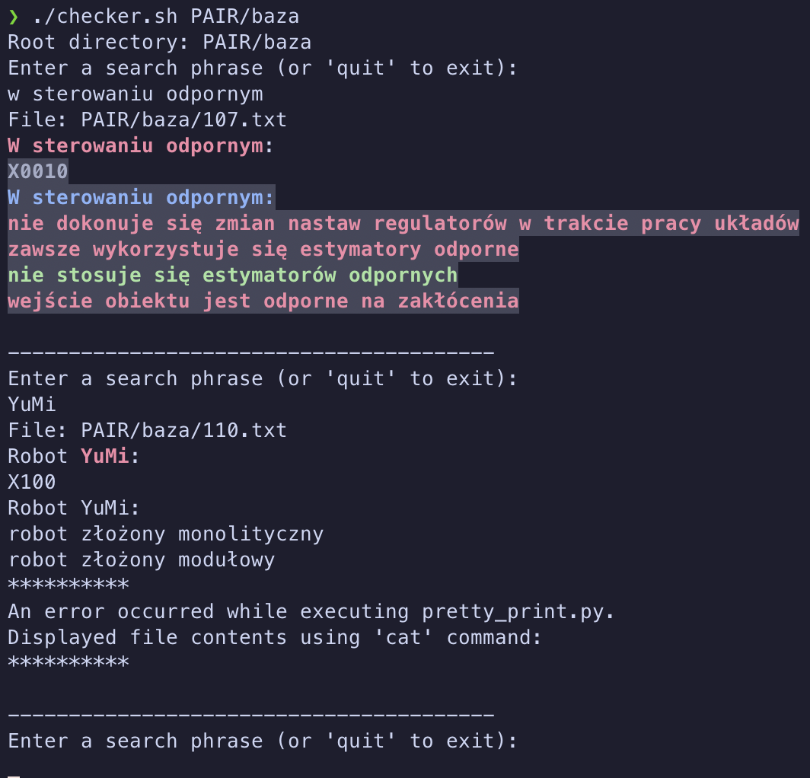

# Testownik Quickcheck

## "Instalacja"

```bash
git clone https://github.com/ikrzywda/testownik-checker.git
cd testownik-checker
```

## Uzycie

- pobierz wybrany testownik (najwygodniej do folderu z głównym skryptem)
- uzycie skryptu

```bash
./checker.sh <ściezka do bazy testownika> # np. PAIR/baza
```

- wpisz szukaną frazę
- oczekiwane wyjście:



Fallback na `cat` jest spowodowany brakiem mozliwości sparsowania pliku
